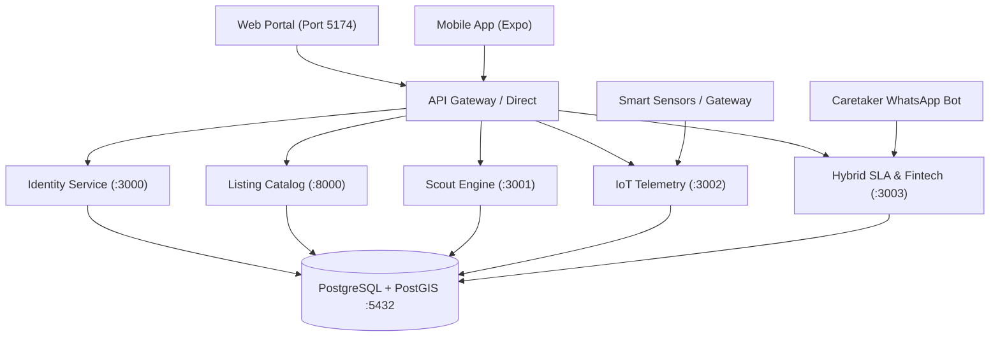

# 📘 Flex-Living Technical Stack & Architecture Playbook

> **Living Technical Playbook & Architecture Documentation**  
> **Version:** 1.3.0  
> **Last Updated:** 2026-08-29  
> **Maintained by:** QA Lead & SME Architecture Agents

---

## 🛠️ 1. Technical Stack Inventory

| Component | Technology | Version | Purpose |
| :--- | :--- | :--- | :--- |
| **Primary Database** | PostgreSQL + PostGIS | 15-3.3-alpine | Relational data, spatial geometry, and time-series telemetry |
| **Cache & Queue** | Redis | 7-alpine | In-memory sessions, task queuing, rate-limiting |
| **Identity Service** | Node.js / Express | Node v24 / Express 5 | User management, phone OTP, JWT auth, Ghana Card KYC |
| **Listing Service** | Python / FastAPI | Python 3.14 / FastAPI 0.141 | PostGIS ST_DWithin spatial radius search, property catalog |
| **Field Scout Engine** | Node.js / Express | Express 4.19 / pg 8.12 | Audit task queue, 200+ checklist evaluation, badge calculator |
| **IoT Telemetry Engine**| Node.js / Express | Express 4.19 / pg 8.12 | Hardware sensor ingestion, automated SLA watchdog |
| **Hybrid SLA & Fintech**| Node.js / Express | Express 4.19 / pg 8.12 | Geofenced tenant claims, caretaker WhatsApp pulse, Flex-Advance |
| **Mobile App Client** | React Native / Expo | Expo SDK 57 / React 19 | Tenant cross-platform mobile experience |
| **Mobile Styling** | NativeWind / Tailwind | Tailwind 3.3.2 / NativeWind 2 | Design tokens on native mobile components |
| **Web Platform Client** | React / Vite | Vite 8.2 / React 19 | Responsive desktop & tablet portal, interactive map split-screen |
| **Source Control** | Git / GitHub | Dual Branch (dev / main) | Automated QA merge gatekeeping |

---

## 🔌 2. Service Architecture & Port Mapping



### Port Map:
* **Port 3000:** `backend/identity-service` (Auth, JWT, KYC)
* **Port 8000:** `backend/listing-service` (FastAPI PostGIS Spatial Catalog)
* **Port 3001:** `backend/scout-service` (Field Scout Audits & Trust Badges)
* **Port 3002:** `backend/iot-service` (IoT Telemetry & SLA Watchdog)
* **Port 3003:** `backend/hybrid-sla-service` (Non-IoT SLA, WhatsApp Pulse, Flex-Advance)
* **Port 5174:** `prototype/` (Vite + React Web Client)
* **Port 5432:** PostgreSQL 15 + PostGIS Docker Container (`flexliving_db`)
* **Port 6379:** Redis Docker Container (`flexliving_redis`)

---

## 📜 3. Phase-by-Phase Technical Changelog

### Phase 1: Foundations
* **Architecture Change:** Replaced standard PostgreSQL with `postgis/postgis:15-3.3-alpine` to fix host macOS extraction errors and enable PostGIS geometry calculations.
* **Identity Stack:** Built Node.js microservice using raw `pg` connection pool, bcrypt hashing, JWT issuance, and mocked Ghana Card regex verification (`GHA-xxxxxxxxx-x`).
* **Listing Stack:** Built Python FastAPI service with `geoalchemy2` executing `ST_DWithin` spatial calculations.
* **Frontend Web:** Built Vite React client with custom CSS glassmorphism.
* **Frontend Mobile:** Scaffolded Expo application configured with NativeWind.

### Phase 2: Scout Engine & IoT Telemetry
* **Database Migration (`phase2_schema.sql`):** Added `scout_tasks`, `iot_devices`, `iot_telemetry`, and `sla_breaches` tables with compound time-series indexes.
* **Field Scout Logic:** Implemented automated 200+ checklist validation awarding badges:
  * `SOLAR_VERIFIED`: Solar backup $\ge$ 3kVA.
  * `STARLINK_VERIFIED`: Starlink download $\ge$ 100 Mbps.
  * `BOREHOLE_VERIFIED`: Independent water supply confirmed.
  * `SMART_ACCESS_VERIFIED`: Keyless digital lock validated.
* **IoT Watchdog Logic:** Automated state machine triggering active `POWER_FAILURE` breach when Grid is `OFFLINE` and Generator is `FAULT/OFF`.
* **Bug Fix / QA Catch:** Fixed column naming mismatch (`generatorStatus` vs `generator_status`) caught by QA test suite.

### Phase 4: Unified API Gateway, Caretaker WhatsApp Webhook & Mobile Elevation
* **API Gateway Service (`backend/api-gateway` - Port 3004):**
  - Unified reverse proxy with dynamic path resolution routing `/v1/auth`, `/v1/listings`, `/v1/scout`, `/v1/iot`, `/v1/sla`, and `/v1/fintech`.
* **Inbound WhatsApp Caretaker Webhook:**
  - Automated natural language parsing of morning caretaker reports (`/v1/sla/whatsapp/inbound`), recording grid status, fuel levels, water supply, and triggering proactive refill dispatches.
* **Mobile App Elevation (`mobile/App.js`):**
  - Upgraded React Native Expo application with 4-tab navigation:
    1. **Explore:** PostGIS listings, amenity filter chips, and currency converter.
    2. **Smart Key:** 1-Tap NFC/BLE digital lock unlock simulation with AES-256 handshake.
    3. **SLA Diagnostics:** Geofenced outage claim and live 2-Hour countdown timer.
    4. **Flex-Profile:** Tier 2 Ghana Card KYC badge, payroll deduction schedule, and upfront savings.

---

## 🏃 4. Operational Runbook

### Start Infrastructure:
```bash
cd backend
docker compose up -d
```

### Start Microservices:
```bash
# Identity Service (:3000)
cd backend/identity-service && npm start

# Listing Catalog Service (:8000)
cd backend/listing-service && source venv/bin/activate && python3 main.py

# Scout Engine (:3001)
cd backend/scout-service && npm start

# IoT Telemetry (:3002)
cd backend/iot-service && npm start

# Hybrid SLA & Fintech (:3003)
cd backend/hybrid-sla-service && npm start

# Unified API Gateway (:3004)
cd backend/api-gateway && npm start
```

### Start Frontend Clients:
```bash
# Web Client (:5174)
cd prototype && npm run dev

# Mobile App
cd mobile && npx expo start
```

---

## 🧪 5. QA Certification Test Suites

Run all automated QA suites from the workspace root:

```bash
# Phase 1: Identity & KYC Tests
node backend/identity-service/qa_test.js

# Phase 1: PostGIS Spatial Queries
cd backend/listing-service && source venv/bin/activate && python3 test_listings.py && cd ../..

# Phase 2: Scout Audits & IoT SLA Watchdog
NODE_PATH=backend/scout-service/node_modules node backend/qa_phase2_test.js

# Phase 3: Hybrid Non-IoT SLA, WhatsApp Caretaker & Flex-Advance
NODE_PATH=backend/scout-service/node_modules node backend/qa_phase3_test.js

# Phase 4: API Gateway, Caretaker Inbound Webhook & End-to-End Routing
node backend/qa_phase4_test.js
```

---

## ✍️ 6. QA Sign-Off Records

* **Phase 1 Certification:** APPROVED (7/7 Tests Passed) - Date: 2026-08-28
* **Phase 2 Certification:** APPROVED (13/13 Tests Passed) - Date: 2026-08-29
* **Phase 3 Certification:** APPROVED (12/12 Tests Passed) - Date: 2026-08-29
* **Phase 4 Certification:** APPROVED (22/22 Tests Passed) - Date: 2026-08-31
